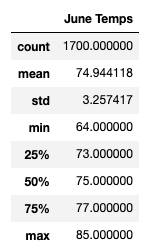
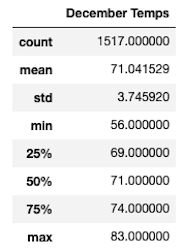
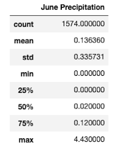
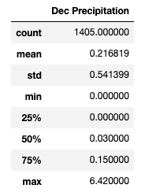
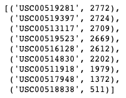
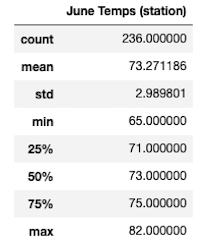
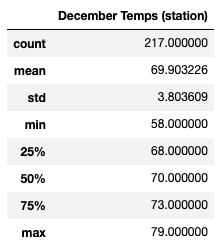

# **Surfs Up Analysis**

## **1. Overview of the Surfs Up Analysis**
Who doesn't love surfing and ice cream! To combine these two passions, I've decided to open up a Surf n' Shake Shop on the Hawaii island of Oahu with a possible investor, W.Avy.  In order to make sure that this is a good investment, W.Avy has asked for some weather data analysis.

In this analysis, I ran analysis on temperature data for the months of June and December on the island to decide if this idea of a surf and ice cream shop is viable all year-round.

## **2. Surfs Up Results**
**Temperature results from June and December**:

    

**Three major points from the temperature results**:

- The average temperatures are higher during the month of June than in December by almost +4 degrees so June definitely is a better time for surfing and ice cream.  However, the difference isn't too drastic in December so December would still be a decent time to partake in the two activities.

- Taking a look at the minimum and the maximum temperatures, it did dip pretty low at 56 degrees during the month of December versus 64 degrees in June so that would not bode too well for ice cream sales or surfing (for those who prefer to surf in warmer weather) in December.  At the maximum end, the difference is only 2 degrees so this should not effect sales too much.  Note that there is a greater variance in December temperatures than in June temperatures (standard deviation of 3.74 vs 3.25).  

- Finally, let's compare the percentiles from June and December to analyze the tails of distribution in the temperatures.  At the 25th percentile the difference is 73 degrees in June vs 69 degrees in December showing that it does get cooler in December.  At the 75th percentile, the difference is 77 degrees in June vs 74 degrees in December.

## **3. Surfs Up Summary**
From the temperature results, we can conclude that opening Surf n' Shake Shop in Oahu will be a viable investment year-round.  There may be a few colder days in December that dips below 60 degrees but overall, the average temperatures aren't too far off from June and December.

However, we should dig deeper than just temperatures to ensure that this is a good year-round investment.  W.Avy's first venture did not succeed due to being rained out so we should analyze some additional data.
- As mentioned, we need to look at precipitation as who wants to surf or eat ice cream when it is raining, even if the temperature is warm.  
    - I ran this [precipitation query](SurfUp_precipitation.ipynb) for the month of June and December for the precipitation data.  
    - Below are the results of the query.  As you can see, the average precipitation is higher in December which will have an effect on sales.  It is still a viable year-round business but as we forecast sales, we should factor in that business will most likely be slower in December.

           

- Another analysis we should look at is the validity of the data.  To check, we should look at how many stations are being used to collect the data and review the data from the most active station.  The best location for the shop could be where the most active station is.
    - I ran this [station query](SurfUp_active_station.ipynb) for analysis.
    - From the analysis, there are 9 stations that were used to collect the data that we have been using with USC00519281 being the most active station.

        

    - The result of the query for the most active station for June and December temperatures are as below.  Here you can see that the average temperatures are lower at the most active station than the 9 stations combined.  Especially for December, the average dips below 70 degrees, not the best for ice cream sales.  However for June, the standard deviation is lower at this station so the temperatures don't swing too extreme which is good for consistent sales.  

           